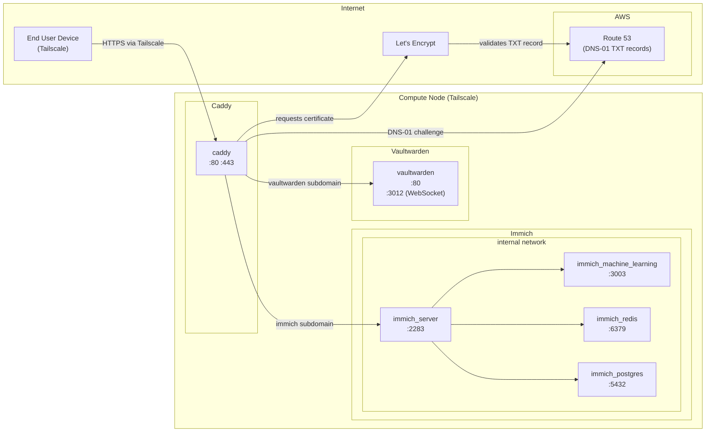

# Architecture

## How It Works

### Routing

Caddy acts as the single entry point, listening on ports **80** and **443**. All traffic
from the internet hits Caddy first, which routes requests to the appropriate backend
service based on the subdomain.

### TLS Certificates (Route 53 DNS-01 Challenge)

Caddy automatically obtains and renews Let's Encrypt TLS certificates using the
**DNS-01 challenge** via the Route 53 plugin. Instead of requiring an open HTTP
port for validation, Caddy:

1. Creates a temporary `_acme-challenge` TXT record in the Route 53 hosted zone
2. Let's Encrypt validates the record
3. Caddy removes the TXT record and stores the certificate

This is configured via the `tls { dns route53 }` directive in the Caddyfile.
AWS credentials (`AWS_ACCESS_KEY_ID`, `AWS_SECRET_ACCESS_KEY`, `AWS_REGION`)
are passed to the container through the `.env` file.

### DNS & Tailscale

The Route 53 hosted zone has an `A` record for `*.mydomain.com` pointing to
the compute node's **Tailscale IP** (e.g. `100.x.x.x`). Since Tailscale IPs are
private to the Tailscale network, only devices connected to the same Tailscale
network can reach these services — the public internet cannot resolve or route to
this address.

This means even though Caddy obtains publicly trusted Let's Encrypt certificates,
the services remain private and accessible only to authorized devices on the
Tailscale network.
